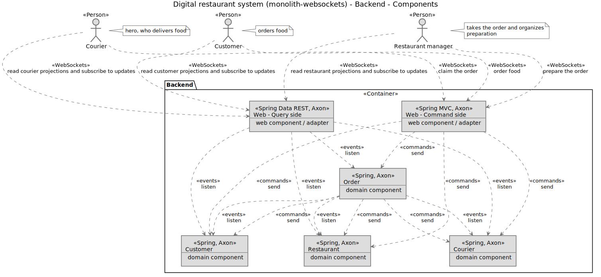

## Monolith 3 (STOMP over WebSockets API. We are async all the way)
#### :octocat: /drestaurant-apps/drestaurant-monolith-websockets :octocat:

*This is a thin layer which coordinates the application activity. It does not contain business logic. It does not hold the state of the business objects*

*We are utilizing [components from the domain layer](../../drestaurant-libs). This layer contains information about the domain. This is the heart of the business software.*

This application is utilizing STOMP over Websockets protocol to expose capabilities of our 'domain' via components:
 
 - [WebController](src/main/kotlin/com/drestaurant/web/WebController.kt)
 - [Event listener](src/main/kotlin/com/drestaurant/query/handler) is a central component. It consumes domain events, and creates 'query models' (materialized views) of aggregates. Aditonally, our event listener is publishing a WebSocket messages to topics on every update of a query model. 

#### Visualize Your Architecture - C4 model

The [C4 software architecture model](https://c4model.com/) is a simple hierarchical way to think about the static structures of a software system in terms of **containers**, **components** and **classes** (or code).

##### System Context Diagram

A System Context diagram can be a useful starting point for diagramming and documenting a software system, allowing you to step back and look at the big picture.


##### Container Diagram

Once you understand how your system fits in to the overall IT environment with a System Context diagram, a really useful next step can be to illustrate the high-level technology choices with a Container diagram. A "container" is something like a web server, application server, desktop application, mobile app, database, file system, etc. Essentially, a container is anything that can execute code or host data.


##### Component Diagram

Following on from a Container diagram showing the high-level technology decisions, you can then start to zoom in and decompose each container further. However you decompose your system is up to you, but this is about identifying the major logical structural building blocks and their interactions.




### STOMP over WebSockets API

WebSocket SockJS endpoint: `ws://localhost:8080/drestaurant/websocket`

#### Topics:

 - `/topic/couriers.updates` (courier list has been updated, e.g. new courier has been created)
 - `/topic/customers.updates` (customer list has been updated, e.g. new customer has been created)
 - `/topic/orders.updates` (order list has been updated, e.g. new order has been created)
 - `/topic/restaurants.updates` (restaurant list has been updated, e.g. new restaurant has been created)
 - `/topic/couriers/orders.updates` (courier order list has been updated, e.g. new courier order has been created)
 - `/topic/restaurants/orders.updates`(restaurant order list has been updated, e.g. new restaurant order has been created)

 
#### Message endpoints:

 - `/customers/createcommand`, messageType=[MESSAGE]
 - `/customers`, messageType=[SUBSCRIBE]
 - `/customers/{id}`, messageType=[SUBSCRIBE]
 - `/couriers/createcommand`, messageType=[MESSAGE]
 - `/couriers`, messageType=[SUBSCRIBE]
 - `/couriers/{id}`, messageType=[SUBSCRIBE]
 - `/couriers/orders/assigncommand`, messageType=[MESSAGE]
 - `/couriers/orders/markdeliveredcommand`, messageType=[MESSAGE]
 - `/couriers/orders`, messageType=[SUBSCRIBE]
 - `/couriers/orders/{id}`, messageType=[SUBSCRIBE]
 - `/restaurants/createcommand`, messageType=[MESSAGE]
 - `/restaurants`, messageType=[SUBSCRIBE]
 - `/restaurants/{id}`, messageType=[SUBSCRIBE]
 - `/orders/createcommand`, messageType=[MESSAGE]
 - `/orders`, messageType=[SUBSCRIBE]
 - `/orders/{id}`, messageType=[SUBSCRIBE]
 - `/restaurants/orders/markpreparedcommand`, messageType=[MESSAGE]
 - `/restaurants/orders`, messageType=[SUBSCRIBE]
 - `/restaurants/orders/{id}`, messageType=[SUBSCRIBE]


### Run the application

```bash
$ cd digital-restaurant/drestaurant-apps/drestaurant-monolith-websockets
$ mvn spring-boot:run
```


### Infrastructure
- [H2 - java SQL databse][h2]
 

[mvn]: https://maven.apache.org/
[kotlin]: https://kotlinlang.org/
[spring]: https://spring.io/
[axonframework]: https://axoniq.io/
[mysql]: https://www.mysql.com/
[h2]: http://h2database.com/html/main.html