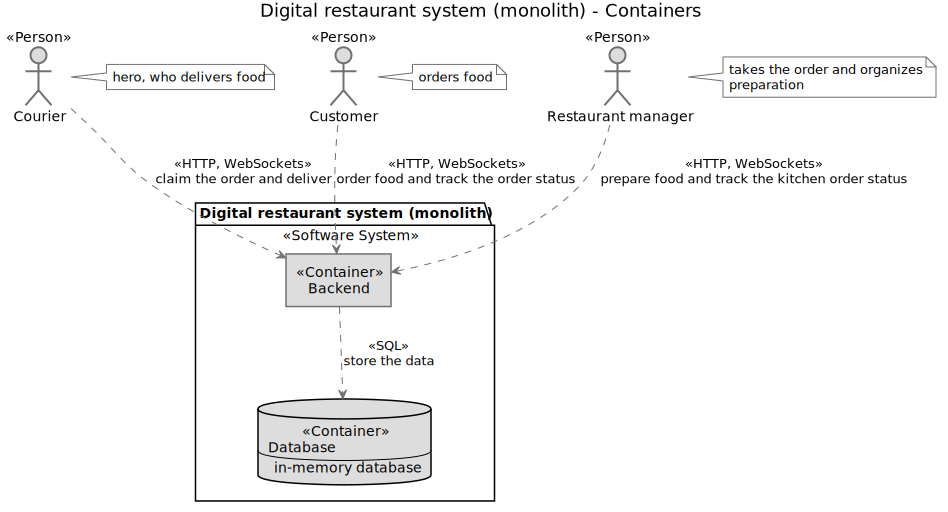
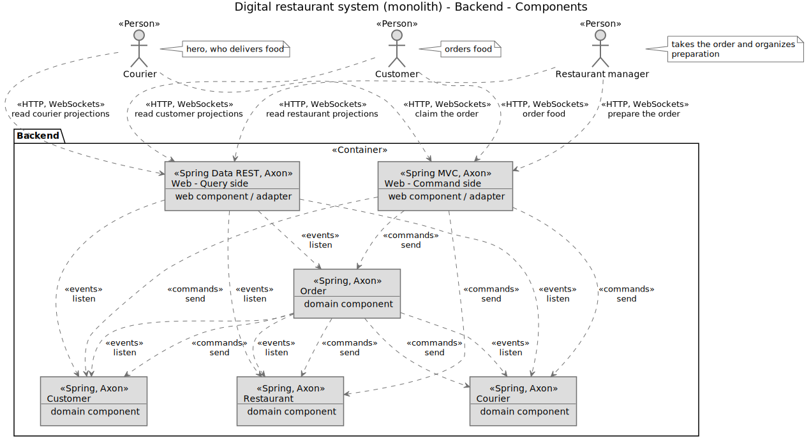

## Monolith (HTTP and WebSockets API by segregating Command and Query)
#### :octocat: /drestaurant-apps/drestaurant-monolith :octocat:

*This is a thin layer which coordinates the application activity. It does not contain business logic. It does not hold the state of the business objects*

*We are utilizing [components from the domain layer](../../drestaurant-libs). This layer contains information about the domain. This is the heart of the business software.*

A recurring question with CQRS and EventSourcing is how to put a synchronous HTTP front-end on top of an asynchronous CQRS back-end.

In general there are two approaches:

 - **segregating Command and Query** - resources representing Commands (request for changes) and resources representing Query Models (the state of the domain) are decoupled
 - **not segregating Command and Query** - one-to-one relation between a Command Model resource and a Query Model resource
 
 This application is using the first approach ('segregating Command and Query') by exposing capabilities of our 'domain' via the HTTP/REST API components that are responsible for
 - dispatching commands - [CommandController](src/main/kotlin/com/drestaurant/web/CommandController.kt)
 - querying the 'query model' (materialized views) - [Spring REST repositories](src/main/kotlin/com/drestaurant/query/repository)

**There is no one-to-one relation between a Command resource and a Query Model resource. This makes easier to implement multiple representations of the same underlying domain entity as separate resources.**


[Event listener](src/main/kotlin/com/drestaurant/query/handler) is a central component. It consumes events, and creates 'query models' (materialized views) of aggregates.
This makes querying of event-sourced aggregates easy.

Aditonally, our event listener is publishing a WebSocket events on every update of a query model. 
This can be usefull on the front-end to re-fetch the data via HTTP/REST endpoints.

#### Visualize Your Architecture - C4 model

The [C4 software architecture model](https://c4model.com/) is a simple hierarchical way to think about the static structures of a software system in terms of **containers**, **components** and **classes** (or code).

##### System Context Diagram

A System Context diagram can be a useful starting point for diagramming and documenting a software system, allowing you to step back and look at the big picture.


##### Container Diagram

Once you understand how your system fits in to the overall IT environment with a System Context diagram, a really useful next step can be to illustrate the high-level technology choices with a Container diagram. A "container" is something like a web server, application server, desktop application, mobile app, database, file system, etc. Essentially, a container is anything that can execute code or host data.



##### Component Diagram

Following on from a Container diagram showing the high-level technology decisions, you can then start to zoom in and decompose each container further. However you decompose your system is up to you, but this is about identifying the major logical structural building blocks and their interactions.




#### 'Command' HTTP API

##### Create new Restaurant
```
curl -X POST --header 'Content-Type: application/json' --header 'Accept: */*' -d '{
  "menuItems": [
    {
      "id": "id1",
      "name": "name1",
      "price": 100
    }
  ],
  "name": "Fancy"
}' 'http://localhost:8080/api/command/restaurant/createcommand'
```
##### Create/Register new Customer
```
curl -X POST --header 'Content-Type: application/json' --header 'Accept: */*' -d '{
  "firstName": "Ivan",
  "lastName": "Dugalic",
  "orderLimit": 1000
}' 'http://localhost:8080/api/command/customer/createcommand'
```
##### Create/Hire new Courier
```
curl -X POST --header 'Content-Type: application/json' --header 'Accept: */*' -d '{
  "firstName": "John",
  "lastName": "Doe",
  "maxNumberOfActiveOrders": 20
}' 'http://localhost:8080/api/command/courier/createcommand'
```
##### Create/Place the Order
```
curl -X POST --header 'Content-Type: application/json' --header 'Accept: */*' -d '{
  "customerId": "CUSTOMER_ID",
  "orderItems": [
    {
      "id": "id1",
      "name": "name1",
      "price": 100,
      "quantity": 0
    }
  ],
  "restaurantId": "RESTAURANT_ID"
}' 'http://localhost:8080/api/command/order/createcommand'
```
Note: Replace CUSTOMER_ID and RESTAURANT_ID with concrete values.

##### Restaurant marks the Order as prepared
```
curl -X POST --header 'Content-Type: application/json' --header 'Accept: */*' 'http://localhost:8080/api/command/restaurant/order/RESTAURANT_ORDER_ID/markpreparedcommand'

```
Note: Replace RESTAURANT_ORDER_ID with concrete value.

##### Courier takes/claims the Order that is ready for delivery (prepared)
```
curl -X POST --header 'Content-Type: application/json' --header 'Accept: */*' 'http://localhost:8080/api/command/courier/COURIER_ID/order/COURIER_ORDER_ID/assigncommand'

```
Note: Replace COURIER_ID and COURIER_ORDER_ID with concrete values.

##### Courier marks the Order as delivered
```
curl -X POST --header 'Content-Type: application/json' --header 'Accept: */*' 'http://localhost:8080/api/command/courier/order/COURIER_ORDER_ID/markdeliveredcommand'

```


#### 'Query' HTTP API
Application is using an event handler to subscribe to all interested domain events. Events are materialized in SQL database schema. 

HTTP/REST API for browsing the materialized data:

```
curl http://localhost:8080/api/query
```

#### WebSocket (STOMP) API

WebSocket API (ws://localhost:8080/drestaurant/websocket) topics:

 - /topic/couriers.updates (noting that courier list has been updated, e.g. new courier has been created)
 - /topic/customers.updates (noting that customer list has been updated, e.g. new customer has been created)
 - /topic/orders.updates (noting that order list has been updated, e.g. new order has been created)
 - /topic/restaurants.updates (noting that restaurant list has been updated, e.g. new restaurant has been created)


### Run the application

```bash
$ cd digital-restaurant/drestaurant-apps/drestaurant-monolith
$ mvn spring-boot:run
```

### Infrastructure
- [H2 - java SQL databse][h2]


[mvn]: https://maven.apache.org/
[kotlin]: https://kotlinlang.org/
[spring]: https://spring.io/
[axonframework]: https://axoniq.io/
[mysql]: https://www.mysql.com/
[h2]: http://h2database.com/html/main.html